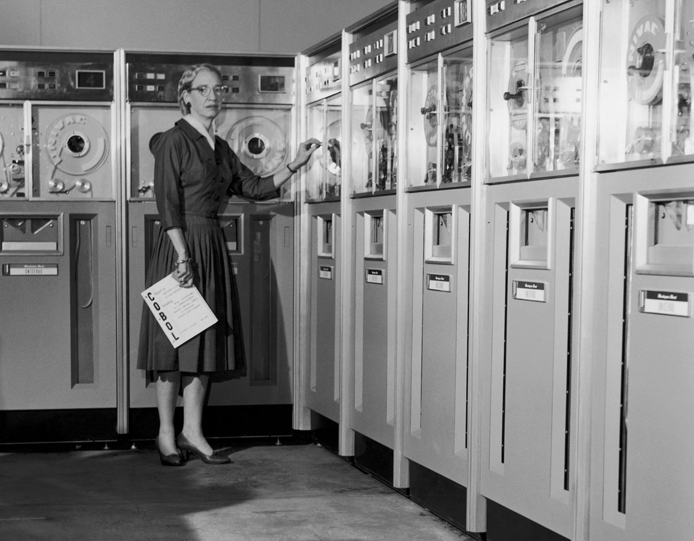
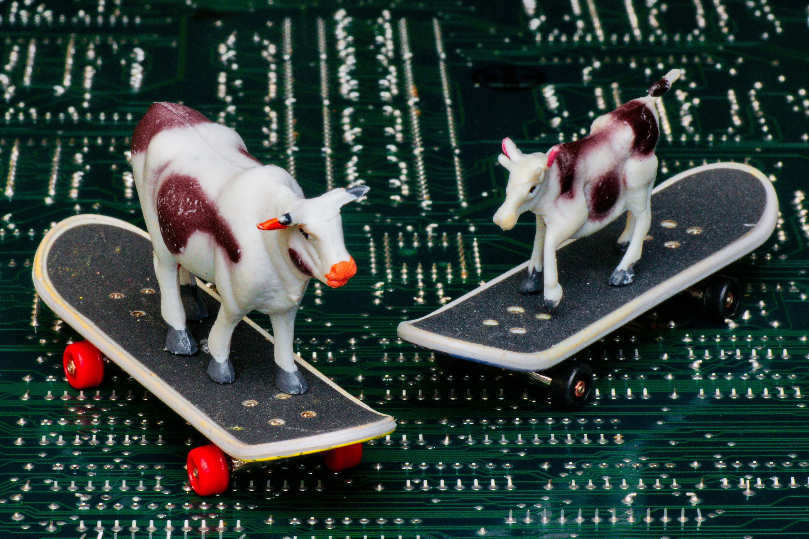

footer: Lotte Steenbrink, iNET HAW Hamburg	
slidenumbers: true

# **Hybrid Routing for the IoT**
## challenges & opportunities

^ 
- AW1: existing; either proactive || reactive 
- new technologies & Use Cases @ IoT have emerged
- with them: new network characteristic

---
#       **proactive**         **reactive**
###     

^ 
- bring p&a together in hybrid prots this sem 
- -> adapt to changes @ network characteristics
- comes with own set of challenges:
	* when/where to switch
	* coordinate 2 fundamentally different routing approaches
	* most research stems from time where IoT vision didnt exist -> necessary to adjust & advance

---
# **Quick history lesson** 

^
TODO: insert pictures of 2000 vs 2014 hardware/visions for mobile nodes here
- ZRP etc: 2006 or earlier
- research has stalled since them
- failure or too early? -> too early.

---
# **The time is now** 

^research is 10 years old, BUT!! 
- now we have the building blocks in place
- let's take the old ideas and translate them to 2014+

---
# **Some fancy headline which introduces that I'm going to talk about concepts now** 
^
- I'm not going to bore you with lists of outdated protocols
- instead, i'm going to talk about concepts that they introduce and use some of them as examples
- comprehensive list can be found at TODO

---
#        **route                         area** 

^
TODO: speaker notes that explain both approaches & give protocol examples

---
#        **route                         area** 

^
- Lighting system: central control (proactive); connection between sofa lamp & switch if person is in room (reactive)
- warehouse: truckload needsa to know abt each other, rest of warehouse less relevant

TODO: attribution into bibliography: Computer designed by Ji Sub Jeong from the Noun Project, Light bulbs designed by Julien Deveaux from the Noun Project, 
Lamps designed by Renee Ramsey-Passmore, Thomas Le Bas and Becca O'Shea from the Noun Project || Rubber Duck designed by Simon Child from the Noun Project, Rocking Horse designed by Okan Benn from the Noun Project, Circus Elephant designed by Solène Troussé from the Noun Project, Lego designed by Okan Benn from the Noun Project, Lego designed by jon trillana from the Noun Project, Game Boy designed by Simon Child from the Noun Project

---
# **Protocol vs Framework** 
TODO: content

^TODO: speaker notes

---
# **But what about the IoT?** 
TODO: okay cool, and what's suitable for the IoT now? how do we translate this to the 21st century?

---
# **Conclusion** 

---
# **Thank You** 

^TODO: attribution in references: Skating Cows by Mark Turnauckas

---
# **References** 
TODO
