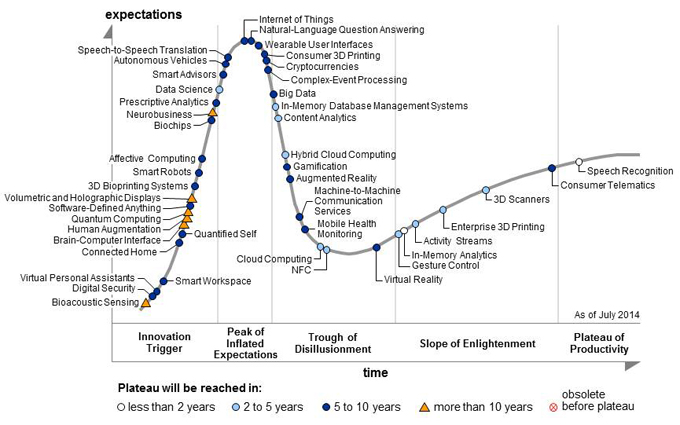
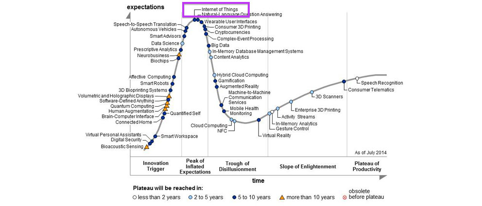
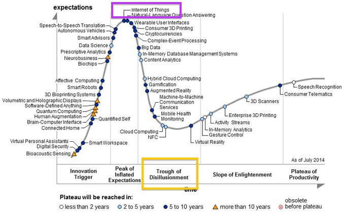
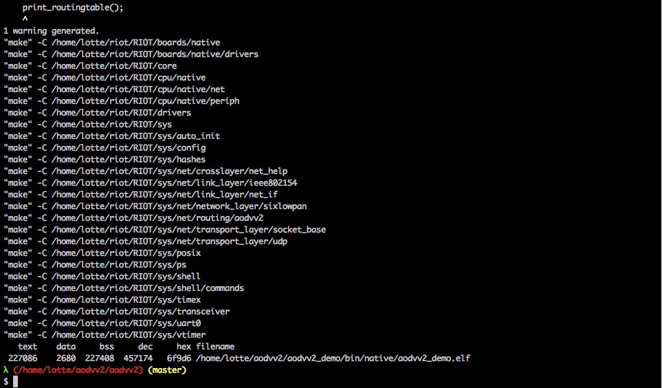
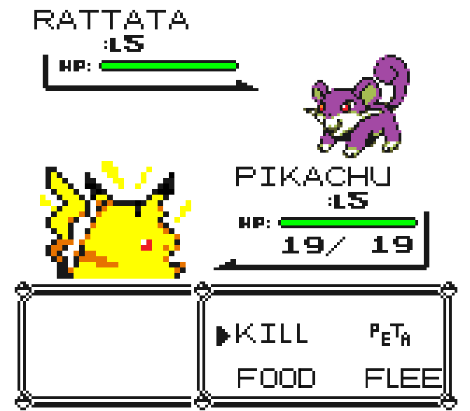
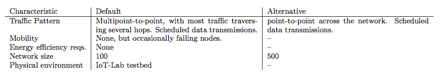

slidenumbers: true
<!--footer: Lotte Steenbrink, iNET HAW Hamburg -->

#**Routing protocol evaluation for the IoT**
##challenges and opportunities

^
Talked *a lot* about routing protocols. Jetzt mal Butter bei die Fische.

---
# **Outline**
- Simulation vs Experimentation
- Network characterization & evaluation metrics
- Setup & execution
- Measurements & evaluation

---

^
this is the hype cycle for emerging technologies

---

^
The IoT is at its peak

---

^
And soon we'll all realize that the hardware is still too big and too expensive, and that we have no idea what we're doing.
- We talk a lot about the IoT, but we don't have much hands-on experience with it, at least when it comes to routing. We need to compare the performance of protocols and see if/where they fail unexpectedly. We used to do this mainly through simulation. but.
- goal: create a life-like experimentation environment and see how different routing protocols perform under different circumstances

---
#**Simulation is great.**

^
- quickly try out ideas,

---
#**Simulation is great.**
- cheap

---
#**Simulation is great.**
- cheap
- controllable

---
#**Simulation is great.**
- cheap
- controllable
- reproducible

---
#**Simulation is great.**
- cheap
- controllable
- reproducible
- scalable

---
#**Simulation is not enough.**

^
- can't model LLN quirkyness which directly impacts protocol operations
- no simulation model is perfect
- can't know if our model is correct without comparison to “real life”

---
#**Simulation is not enough.**
- unverified models

^
- no simulation model is perfect
- can't know if our model is correct without comparison to “real life”

---
#**Simulation is not enough.**
- unverified models
- unrealistic network behavior

---
#**Experimentation on testbeds.**

^
- experience “real life” quirks in a controlled (in terms of topology, traffic flow etc) environment
- problems: hard to reproduce, often small scale, limited hardware, limited control over mobility etc
- slowly getting solved, see wisebed, iot-lab etc

---
#**Getting our ducks in a row:**
#Network characterization & performance metrics

^
- before we run experiments, we need to know what we're dealing with:
- which are the siginifcant characteristics of IoT networks?
- by which metrics do we judge routing protocols

---
#Network Characteristics

- Traffic patterns
- Mobility
- Energy consumption
- Network size
- Physical environment

^
Kurz halten, hatten wir schon

<!--
---
# Traffic Patterns

^
- typically low volume, traffic can be bursty or stream and go in different directions:

---
# Traffic Patterns

---
# Traffic Patterns

---
# Mobility

-->

---
#Performance Metrics

^
by what do we measure the efficiency of a protocol?

---
# Latency

---
# Failure recovery

^
- ability to detect broken routes and recover them quickly

---
# Route stability &
# convergence

---
# Energy efficiency

---
# Code & storage size

---
#**Setup & execution.**

^
- chose IoT-Lab testbed because yadda yadda
- current setup is just a starting point and should be paramtrized & exendable

---

#Protocols

^
in general, any protocols welcome, but currently we only have two but they're a great start because they are very different

---

---
#Network model

^
Now that we know what to look out for, and which protocols to use, we'll need to decide on a Network structure (out of the many facets ans iot network can have)

---

^
- just like pokemon, routing protocols excel under different conditions. That's why I chose to create a base model and then switch some of the parameters up to see how the protocols' behavior changes

---

^
- note that we have no influence on the physical environment and don't monitor for energy efficiency yet

---
#Execution

^
- combine default & alternative
- central: different traffic pattern

---
#Execution: 
#multipoint to point

---
#Execution: 
#point to point

---
#**Measurements & evaluation.**

^
- store ALL the data
- this is what we're going to find out, and with which measurements
- challenge: time synchronization

---
#Measurements & evaluation.
- **Latency**: dispatch time - arrival time
- **Failure recovery**: shutdown time - changes in routing table
- **Energy efficiency**: overall energy consumption
- **Reliability**: packet loss

---
#**Conclusion**

---
#**Thank You!**

---
#**References**

• Gartner's hype cycle for Emerging technologies, 2014. [https://www.gartner.com/doc/2809728](https://www.gartner.com/doc/2809728), accessed 26.07.2015
• M. S. Corson and J. Macker, “Mobile Ad hoc Networking (MANET): Routing Protocol Performance Issues and Evaluation Considerations,” RFC 2501, IETF, January 1999.
• A. Brandt, J. Buron, and G. Porcu, “Home Automation Routing Requirements in Low-Power and Lossy Networks,” RFC 5826, IETF, April 2010.
• J. Martocci, P. D. Mil, N. Riou, and W. Vermeylen, “Building Automation Routing Requirements in Low-Power and Lossy Networks,” RFC 5867, IETF, June 2010.
• M. Dohler, T. Watteyne, T. Winter, and D. Barthel, “Routing Requirements for Urban Low-Power and Lossy Networks,” RFC 5548, IETF, May 2009. 
• R. Jedermann, T. Pötsch, and C. Lloyd, “Communication techniques and challenges for wireless food quality monitoring,” Philosophical Transactions of the Royal Society of London A: Mathematical, Physical and Engineering Sciences, vol. 372, no. 2017, 2014.

---

• A.-S. Tonneau, N. Mitton, and J. Vandaele, “A survey on (mobile) wireless sensor network experimentation testbeds,” in Distributed Computing in Sensor Systems (DCOSS), 2014 IEEE International Conference on, pp. 263–268, May 2014.
• D. Kotz, C. Newport, and C. Elliott, “The mistaken axioms of wireless-network research,” tech. rep., Dartmouth Computer Science, July 2003.
• G. Coulson, B. Porter, I. Chatzigiannakis, C. Koninis, S. Fischer, D. Pfisterer, D. Bimschas, T. Braun, P. Hurni, M. Anwander, G. Wagenknecht, S. P. Fekete, A. Kröller, and T. Baumgartner, “Flexible experimentation in wireless sensor networks,” Commun. ACM, vol. 55, pp. 82–90, Jan. 2012.
• L. Atzori, A. Iera, and G. Morabito, “The internet of things: A survey,” Comput. Netw., vol. 54, pp. 2787–2805, Oct. 2010.
• J. Gubbi, R. Buyya, S. Marusic, and M. Palaniswami, “Internet of things (iot): A vision, architectural elements, and future directions,” Future Generation Computer Systems, vol. 29, no. 7, pp. 1645 – 1660, 2013.
• T. Clausen and P. Jacquet, “Optimized Link State Routing Protocol (OLSR),” RFC 3626, IETF, October 2003.
• E. Baccelli, O. Hahm, M. Günes, M. Wählisch, and T. C. Schmidt, “RIOT OS: Towards an OS for the Internet of Things,” in Proc. of the 32nd IEEE INFOCOM. Poster, (Piscataway, NJ, USA), IEEE Press, 2013.
• T. Winter, P. Thubert, A. Brandt, J. Hui, R. Kelsey, P. Levis, K. Pister, R. Struik, J. Vasseur, and R. Alexander, “RPL: IPv6 Routing Protocol for Low-Power and Lossy Networks,” RFC 6550, IETF, March 2012.
• C. Perkins, S. Ratliff, J. Dowdell, L. Steenbrink, and V. Mercieca, “Dynamic MANET On-demand (AODVv2) Routing,” Internet-Draft – work in progress 09, IETF, May 2015.
