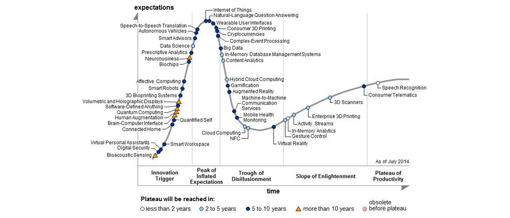
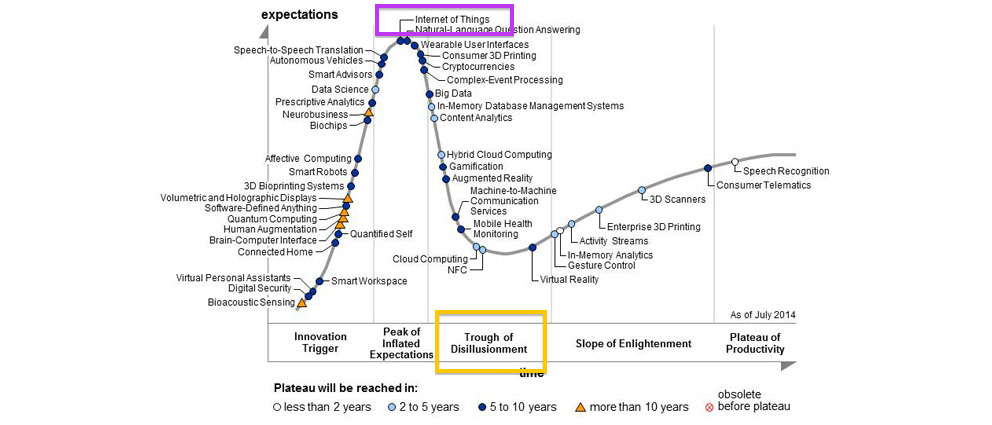

slidenumbers: true
<!--footer: Lotte Steenbrink, iNET HAW Hamburg -->

#**Routing protocol evaluation for the IoT**
##challenges and opportunities

^
Talked *a lot* about routing protocols. Jetzt mal Butter bei die Fische.

---
#**TODO**
^ 
TODO Inhaltsverzeichnis

---

^
this is the hype cycle for emerging technologies

---

^
The IoT is at its peak

---

^
And soon we'll all realize that the hardware is still too big and too expensive, and that we have no idea what we're doing.
- We talk a lot about the IoT, but we don't have much hands-on experience with it, at least when it comes to routing. We need to compare the performance of protocols and see if/where they fail unexpectedly. We used to do this mainly through simulation. but.
- goal: create a life-like experimentation environment and see how different routing protocols perform under different circumstances

---
#**Simulation is great.**
- cheap
- controllable
- reproducible
- scalable

^
- quickly try out ideas,

---
#**Simulation is not enough.**
- unverified models
- unrealistic network behavior

^
- can't model LLN quirkyness which directly impacts protocol operations
- no simulation model is perfect
- can't know if our model is correct without comparison to “real life”

---
#**Experimentation on testbeds.**

^
- experience “real life” quirks in a controlled (in terms of topology, traffic flow etc) environment
- problems: hard to reproduce, often small scale, limited hardware, limited control over mobility etc
- slowly getting solved, see wisebed, iot-lab etc

---
#**Getting our ducks in a row:**
#Network Characteristics and Performance Metrics

^
- before we run experiments, we need to know what we're dealing with:
- which are the siginifcant characteristics of IoT networks?
- by which metrics do we judge routing protocols

---
#Network Characteristics

- Traffic patterns
- Mobility
- Energy consumption
- Network size
- Physical environment

^
Kurz halten, hatten wir schon

<!--
---
# Traffic Patterns

^
- typically low volume, traffic can be bursty or stream and go in different directions:

---
# Traffic Patterns

---
# Traffic Patterns

---
# Mobility

-->

---
#Performance Metrics

^
by what do we measure the efficiency of a protocol?

---
# Latency

---
# Failure recovery

^
- ability to detect broken routes and recover them quickly

---
# Route stability &
# convergence

---
# Energy efficiency

---
# Code & storage size

---
#**Setup & execution.**

^
- chose IoT-Lab testbed because 

---

#Protocols

^
in general, any protocols welcome, but currently we only have two but they're a great start because they are very different

---

---
#Network Model

^
Now that we know what to look out for, and which protocols to use, we'll need to decide on a Network structure (out of the many facets ans iot network can have)

---

^
- just like pokemon, routing protocols excel under different conditions. That's why I chose to create a base model and then switch some of the parameters up to see how the protocols' behavior changes

---

^
- note that we have no influence on the physical environment and 

---
#Measurements

^
- store ALL the data
- this is what we#re going to measure

---
#**Evaluation.**

---
#**Thank You!**

---
#**Sources**

TODO