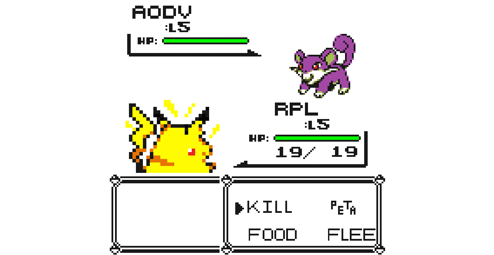

slidenumbers: true
<!--footer: Lotte Steenbrink, iNET HAW Hamburg -->

#**Routing protocol evaluation for the IoT**
##challenges and opportunities

---
# **Outline**

- Motivation
- Approaches
- Preparation
- Experimentation
- Evaluation
- Summary & Outlook

---
# [fit]**Motivation**

---
# **IoT routing**

^
- I'm interested in IoT routing, i.e. how to find paths hrough ad hoc networks of tiny nodes

---
# **IoT routing isn't new**

^
- this is not new: WSN, MANETs have been researched for 20 years

---

^
- but we're looking at a *huge* increase in usage
- We need to get more familiar with our protocols, and we need accessible ways to do this.

---

^
- and I want to contribute this goal by letting different RPs loose on a network and see how they do.
- **goal: compare RP in realistic environments for suitability for the IoT** (-> Pokemonbild!)

---
# [fit]**Approaches**
# simulation vs. experimentation

---
#**Simulation is great.**

^
- quickly try out ideas,

---
#**Simulation is great.**
- cheap

^
quick feedback loop

---
#**Simulation is great.**
- cheap
- controllable

---
#**Simulation is great.**
- cheap
- controllable
- reproducible

---
#**Simulation is great.**
- cheap
- controllable
- reproducible
- scalable

---
#**Simulation is not enough.**

^
- can't model LLN quirkyness which directly impacts protocol operations
- no simulation model is perfect
- can't know if our model is correct without comparison to “real life”

---
#**Simulation is not enough.**
- unverified models

^
- no simulation model is perfect
- can't know if our model is correct without comparison to “real life”

---
#**Simulation is not enough.**
- unverified models
- unrealistic network behavior

---
#**Experimentation on testbeds.**

---
# [fit]**Preparation**
# network characteristics 
# & performance metrics

---
#**Network characteristics**

^
- already talked abt this:
- IoT networks are diverse. There is not *the* IoT setup. These are the key points at which they are different. 

---
#**Network characteristics**

- Traffic patterns

---
#**Network characteristics**

- Traffic patterns
- Mobility

---
#**Network characteristics**

- Traffic patterns
- Mobility
- Energy consumption

---
#**Network characteristics**

- Traffic patterns
- Mobility
- Energy consumption
- Network size

---
#**Network characteristics**

- Traffic patterns
- Mobility
- Energy consumption
- Network size
- Physical environment

---
#**Network characteristics**

^
- We may use different combinations to create different scenarios, but for now let's stick with -> see table from paper; highlight in list & explain

---
# **Performance metrics**

- how do we assess the performance of our protocol in a certain network? These are the aspects we'll actually measure.

---
# Latency

---
# Failure recovery

^
- ability to detect broken routes and recover them quickly

---
# Route stability &
# convergence

---
# Energy efficiency

---
# Code & storage size

---
# [fit]**Experimentation**

---
# Protocols
- RPL
- AODVv2
- OLSR, Ant routing (if available)

---
# Execution

^
- recap: we're using this setup as a sarting point
- If we only had one network setup, this wouldn't show the degrees of versatility & specializedness per protocol
- so we switch some factors up an have a total of 4 combinations.
- central: different traffic pattern, run with 100 and 500 nodes
- goal: implement as modular & variable as possible for future extension
- log ALL the things

---
#Execution: 
#multipoint to point

^
- send traffic from nodes to sink randomly. Make sure that each node sends at least once. There my be duplicates.
- KEEP LIST of “running order”
- do this with 100 and 500 nodes

---
#Execution: 
#point to point

^
- send traffic from node to node randomly. Make sure that each node sends at least once. There my be duplicates.
- KEEP LIST of “running order”
- do this with 100 and 500 nodes

---
# [fit]**Evaluation**

^
- remember: goal was to see how well RPs act under different circumstances
- RPL and AODVv2 claim to be specialized for certain circumstances, but the primary goal isn't to prove/disprove that. would be a nice sideeffect though.
- primary goal: look at the data and see who excels where, and where serious problems are, and if any of them are new.

---
# **Evaluation**

- **Latency**: dispatch time - arrival time
- **Failure recovery**: shutdown time - changes in routing table
- **Energy efficiency**: overall energy consumption
- **Reliability**: packet loss

---
# [fit]**Summary** 
# [fit]**& Outlook**

^
- testbeds are on the rise
- we need them desperately to see if routing protocols live up t their promises, and whether we forgot anything
- we will to do it in a reproducible, versatile manner
- RPs, scenarios and network configs should be extended, maybe based on findings

---
#**Thank You!**

---
#**References**

• M. S. Corson and J. Macker, “Mobile Ad hoc Networking (MANET): Routing Protocol Performance Issues and Evaluation Considerations,” RFC 2501, IETF, January 1999.
• A. Brandt, J. Buron, and G. Porcu, “Home Automation Routing Requirements in Low-Power and Lossy Networks,” RFC 5826, IETF, April 2010.
• J. Martocci, P. D. Mil, N. Riou, and W. Vermeylen, “Building Automation Routing Requirements in Low-Power and Lossy Networks,” RFC 5867, IETF, June 2010.
• M. Dohler, T. Watteyne, T. Winter, and D. Barthel, “Routing Requirements for Urban Low-Power and Lossy Networks,” RFC 5548, IETF, May 2009. 
• R. Jedermann, T. Pötsch, and C. Lloyd, “Communication techniques and challenges for wireless food quality monitoring,” Philosophical Transactions of the Royal Society of London A: Mathematical, Physical and Engineering Sciences, vol. 372, no. 2017, 2014.

---

• A.-S. Tonneau, N. Mitton, and J. Vandaele, “A survey on (mobile) wireless sensor network experimentation testbeds,” in Distributed Computing in Sensor Systems (DCOSS), 2014 IEEE International Conference on, pp. 263–268, May 2014.
• D. Kotz, C. Newport, and C. Elliott, “The mistaken axioms of wireless-network research,” tech. rep., Dartmouth Computer Science, July 2003.
• G. Coulson, B. Porter, I. Chatzigiannakis, C. Koninis, S. Fischer, D. Pfisterer, D. Bimschas, T. Braun, P. Hurni, M. Anwander, G. Wagenknecht, S. P. Fekete, A. Kröller, and T. Baumgartner, “Flexible experimentation in wireless sensor networks,” Commun. ACM, vol. 55, pp. 82–90, Jan. 2012.
• L. Atzori, A. Iera, and G. Morabito, “The internet of things: A survey,” Comput. Netw., vol. 54, pp. 2787–2805, Oct. 2010.
• J. Gubbi, R. Buyya, S. Marusic, and M. Palaniswami, “Internet of things (iot): A vision, architectural elements, and future directions,” Future Generation Computer Systems, vol. 29, no. 7, pp. 1645 – 1660, 2013.
• T. Clausen and P. Jacquet, “Optimized Link State Routing Protocol (OLSR),” RFC 3626, IETF, October 2003.
• E. Baccelli, O. Hahm, M. Günes, M. Wählisch, and T. C. Schmidt, “RIOT OS: Towards an OS for the Internet of Things,” in Proc. of the 32nd IEEE INFOCOM. Poster, (Piscataway, NJ, USA), IEEE Press, 2013.
• T. Winter, P. Thubert, A. Brandt, J. Hui, R. Kelsey, P. Levis, K. Pister, R. Struik, J. Vasseur, and R. Alexander, “RPL: IPv6 Routing Protocol for Low-Power and Lossy Networks,” RFC 6550, IETF, March 2012.
• C. Perkins, S. Ratliff, J. Dowdell, L. Steenbrink, and V. Mercieca, “Dynamic MANET On-demand (AODVv2) Routing,” Internet-Draft – work in progress 09, IETF, May 2015.
