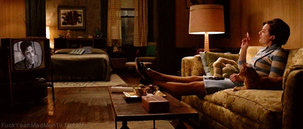

# Jack Hartnett

^
TODO: zusammenfassung des papiers
TODO: Diskussion einleiten nicht vergessen!

---
1. I don’t steal from you
2. You don’t steal from me
3. I don’t lie to you
4. You don’t lie to me
5. If I have to do your job I want your money
6. Never do anything to ruin the reputation of the restaurant
7. If it doesn’t make good common sense don’t do it
8. I will only tell you one time.

^
**Quelle: [^3]**

---
> “I don't want you to go to work unhappy, pissed off, upset, or mad about anything, because I don't think you can be totally focused on making money if you're worried about what's happening at home or at school with your kids.”

^
**Quelle: [^3]**

---

> “You've got to give them a piece of the action. That gives them their drive and their desire to hang in and do it well.”

^
His managers must purchase 25% equity stakes in the restaurants they run. In exchange, they receive 25% of the monthly net profits, a $1,200 monthly salary, and full health benefits for themselves and their dependents, a rarity in the burger world. That's just for starters. Managers who have been with D.L. Rogers for more than 18 months qualify for a bonus of up to 15% of net profits if they meet certain food, labor, and paper costs. And three-year veterans can buy a 1% stake in a new Sonic outlet for about $1,750, as long as they meet certain goals, such as posting an annual net profit of 20%. Supervisors can receive up to 13% of the net profits from the stores they oversee.

---
# Transaktional oder transformational?

---
# Situative Variablen des Erfolgs

^
- publikum mit aufzählen lassen? Evtl einfach an die tafel schreiben?

---
# Würde ich gern für Hartnett arbeiten?

---

---
## Angst ist ein schlechter Motivator

^
- two strikes-Regel
- “Bedenkenlos benutzt er die in seiner Stellung liegende Anmerkungen Autorität, um Regeln aufzustellen und Strafen zu verhängen”
- Er gibt zu, alle immer leicht zu verunsichern, "damit sie härter arbeiten".
- So frightened are they of provoking him that they go out of their way to please him. "If you're really nice and you occasionally get upset, you'll get their attention," he says. [^2]

---
## Not my Circus, not my Monkeys

^
- Keine Beteiligung an Zielsetzung -> weniger einsatz fürs ziel
- widerspruch bei blöden ideen v Hartnett durch das Klima quasi unmöglich
- In 1996 a Texas manager who took it upon himself to computerize his store and take Saturday nights off was passed over for a promotion to supervisor, even though he ran the most profitable store in the chain. "Jack wants you to do things exactly the way he tells you," says the manager, who eventually quit in frustration [3]

---
## Machtmissbrauch

^
TODO: schmissigere überschrift

---
### Falsche Freunde

^
- zwingt “Freundschaft” auf, die effektiv nicht abgelehnt werden kann
- massive grenzüberschritungen (unangekündigte Hausbesuche, Eingriffe ins Liebesleben)
- würde ein echter freund sich so verhalten wäre die freundschaft beendet

---
### Feierabend?

^
- keine klare Abgrenzung zw. Büro- & Privatleben möglich (-> work-life-balance)

---

### Abhängigkeit

^
Kristin Anderson, a Minneapolis-based consultant who has studied similar businesses, fears that those who work for Hartnett may become too dependent on him for their own sense of self-worth, losing their individual identities. "He may be creating a cult of personality where he gains control through the guise of offering personal assistance," she says.

---

### \#normcore

^
- Extreme Normierung:
    - nicht normkonformes verhalten bietet angriffsfläche f kollegen und chef (“kompromat”)
    - besonderer Druck auf marginalisierte angestellte (Nicht Heterosexuell, nicht männlich, nicht able-bodied)
    - Woher weiß ich wie offen/freundschaftlich mein Chef wirklich ist? => noch mehr Angst

---
# Discuss.

^
TODO: fragen vorbereiten.

---
# Weitere Quellen
[^1] Harvey A. Hornstein: The Haves and the Have Nots: The Abuse of Power and Privilege in the Workplace ... and How to Control It. hg. von Financial Times (Prentice Hall), September 2002.
[Leseprobe](https://books.google.de/books?id=J_GlCvSOIOsC&pg=PA53&lpg=PA53&dq=jack+hartnett+rogers+corp&source=bl&ots=uEAvM2q2CP&sig=cPPaAVsxQXsNMV9k2LVpTkmZTbQ&hl=de&sa=X&ei=oXFLVYGPGIqOsAGvzIAI&ved=0CEMQ6AEwBA#v=onepage&q&f=false)
[^2] http://www.inc.com/magazine/19980701/962.html
[^3] http://www.antiessays.com/free-essays/Jack-Hartnett-Ceo-Of-Sonic-64907.html

