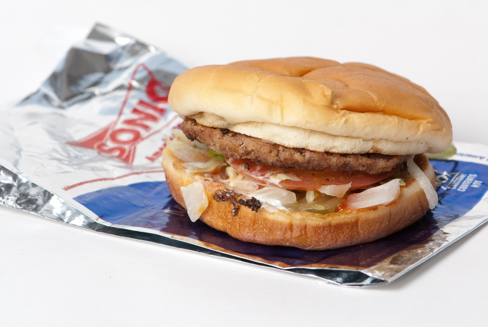
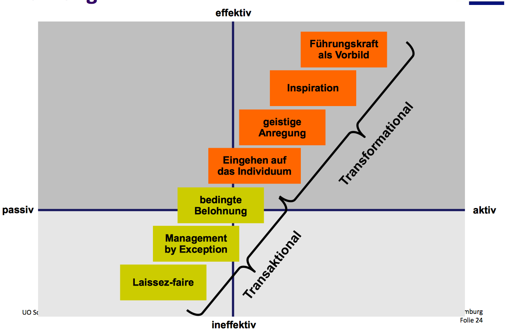
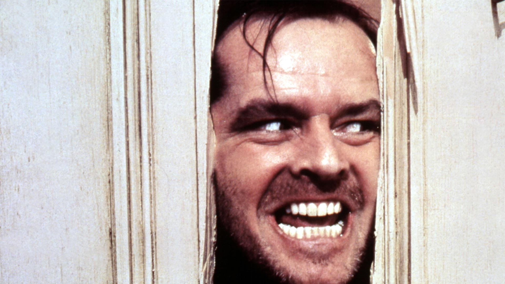
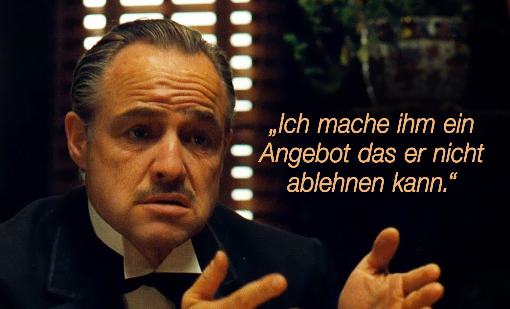
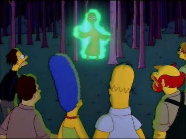

# Jack Hartnett

---

^
- präsident D.L. Rogers Corp., Der Sonix Fastfoodkette gehört
- erfolgreich: Einnahmen pro Restaurant 18% > Durchschnitt, gewinne 25% durschnitt
- erreicht durch führungsstil wie folgt:

---
1. I don’t steal from you
2. You don’t steal from me
3. I don’t lie to you
4. You don’t lie to me
5. If I have to do your job I want your money
6. Never do anything to ruin the reputation of the restaurant
7. If it doesn’t make good common sense don’t do it
8. I will only tell you one time.

^
**Quelle: [^3]**
- selbe regel 2x brechen -> gefeuert
- !! JH nutzt macht rigoros aus
- “Bedenkenlos benutzt er die in seiner Stellung liegende Anmerkungen Autorität, um Regeln aufzustellen und Strafen zu verhängen”

---

# My way or the highway

^
- keine gemeinsame zielerarbeitung
- eigeninitiative wird bestraft (->computerisierung effektiv; manager wurde bei beförderung übergangen)
- Er gibt zu, alle immer leicht zu verunsichern, "damit sie härter arbeiten".

<!-- - In 1996 a Texas manager who took it upon himself to computerize his store and take Saturday nights off was passed over for a promotion to supervisor, even though he ran the most profitable store in the chain. "Jack wants you to do things exactly the way he tells you," says the manager, who eventually quit in frustration [3]
 -->

---

> “You've got to give them a piece of the action. That gives them their drive and their desire to hang in and do it well.”

^
- anstatt einbeziehung: geld 1. motivationsfaktor
- zahlt angestellten das 2-3 fache des Branchendurchschnitts
- Restaurantmanager kaufen 25% Anteile ihres Restaurants, werden entsprechend am Profit beteiligt
- krankenversicherung für Angestellte & familien (selten!!!)

<!--His managers must purchase 25% equity stakes in the restaurants they run. In exchange, they receive 25% of the monthly net profits, a $1,200 monthly salary, and full health benefits for themselves and their dependents, a rarity in the burger world. That's just for starters. Managers who have been with D.L. Rogers for more than 18 months qualify for a bonus of up to 15% of net profits if they meet certain food, labor, and paper costs. And three-year veterans can buy a 1% stake in a new Sonic outlet for about $1,750, as long as they meet certain goals, such as posting an annual net profit of 20%. Supervisors can receive up to 13% of the net profits from the stores they oversee. -->

---

# Ein Freund, ein guter Freund...

^
- aufbau starker persönlicher bindung
- teambuilding 
- teil der starken bindung: starke einbindung ins privatleben
- idee: nur wenn zu hause alles im lot ist, können mitarbeiter sich auf d arbeit konzentrieren
- Aufba v Vertrauensverhältnis, ”verhält sich wie echter Freund sich verhalten würde”
- Beispiele:
    - Spontan zum Essen vorbeikommen
    - Helfen bei Eheproblemen
    - 

<!--“I don't want you to go to work unhappy, pissed off, upset, or mad about anything, because I don't think you can be totally focused on making money if you're worried about what's happening at home or at school with your kids.” -->

---

^
z.f.:
- klare regeln
- keine eigeninitiative oder einbindung
- hohe monetäre belohnung
- starke soziale bindung zu Jack Hartnett

---
# Transaktional oder transformational?

^
Nach dieser Einführung: transaktional oder transformational?

---

^
zur erinnerung: kam in der VL so dran
- JHs führung basiert auf Respekt, loyalität, Bewunderung, vertrauen
- ABER:
    - keine vermittlung von sinn
    - keine gemiensamen ziele
    - keine korrigierenden maßnahmen
    - => Widerspruch zu transaktionaker “basis”

---
# Situative Variablen des Erfolgs

^
- **publikum mit aufzählen lassen => TAFEL!!**
-  Situative Variablen beeinflussen die Wirksamkeit von Führungsverhalten. Beispiele in der Vorlesung dafür waren Strukturierheit der Arbeitsaufgaben oder Positionsmacht der Führungsperson.
- ............................................
    - Burgerbranche -> wenig ansprüche an eigeninitiative?
    - klare Aufgaben, klare Belohnungen
    - JH extrem charismatisch
    - “kümmererrolle” -> mitarbeiter_innen haben geklärtes Privatleben, ruhe im job

---
# Würde ich gern für Hartnett arbeiten?

^
- folgende punkte Diskussionsgrundlage:
- -> das hier ist meine meinung, aber ich hab evtl nen anderen hintergrund & prios als ihr, was findet ihr? 
- -> Einzelne Punkte durchgehen, zwischenrufe annehmen, am Ende offene diskussion 

---

^
positiv: 
- interesse daran, dass mitarbeiter_innen ein (erfülltes) privatleben haben

---
## Angst ist ein schlechter Motivator

^
- two strikes-Regel
- rigorose machtausübung, mitarbeiter verunsichern
- kräfteraubend auf dauer, keine positive bestätigung (übung!)
- So frightened are they of provoking him that they go out of their way to please him. "If you're really nice and you occasionally get upset, you'll get their attention," he says. [^2]
(foto: the shining)

---
<!--## Not my Circus, not my Monkeys-->

^
- Keine Beteiligung an Zielsetzung -> weniger einsatz fürs ziel
- widerspruch bei blöden ideen v Hartnett durch das Klima quasi unmöglich
- eigeninitiative sehr eingeschränkt

---

<!--## Falsche Freunde-->

^
- zwingt “Freundschaft” auf, die effektiv nicht abgelehnt werden kann
- massive grenzüberschritungen (unangekündigte Hausbesuche, Eingriffe ins Liebesleben)
- würde ein echter freund sich so verhalten wäre die freundschaft beendet

---
# Feierabend?

^
- auch wenn Hartnett wert auf gutes privatleben setzt:
- keine klare Abgrenzung zw. Büro- & Privatleben möglich, da boss omnipräsent

---

## Normierung

^
- Extreme Normierung:
    - nicht normkonformes verhalten bietet angriffsfläche f kollegen und chef (“kompromat”)
    - besonderer Druck auf marginalisierte angestellte (Nicht Heterosexuell, nicht männlich, nicht able-bodied)
    - Woher weiß ich wie offen/freundschaftlich mein Chef wirklich ist? => noch mehr Angst

---

## Abhängigkeit

^
- Abhängigkeit nicht nur Lohn sondern auch privat (auch von goodwill von JH)
-!!! Zitat foliensatz 5: Führung braucht kompatible Ziele, macht braucht nur Abhängigkeit!
- Kristin Anderson, a Minneapolis-based consultant who has studied similar businesses, fears that those who work for Hartnett may become too dependent on him for their own sense of self-worth, losing their individual identities. "He may be creating a cult of personality where he gains control through the guise of offering personal assistance," she says.

---

^
Fragen, Anregungen, mehr Diskussion?

---
# Weitere Quellen
- Harvey A. Hornstein: The Haves and the Have Nots: The Abuse of Power and Privilege in the Workplace ... and How to Control It. hg. von Financial Times (Prentice Hall), September 2002. [Leseprobe](https://books.google.de/books?id=J_GlCvSOIOsC&pg=PA53&lpg=PA53&dq=jack+hartnett+rogers+corp&source=bl&ots=uEAvM2q2CP&sig=cPPaAVsxQXsNMV9k2LVpTkmZTbQ&hl=de&sa=X&ei=oXFLVYGPGIqOsAGvzIAI&ved=0CEMQ6AEwBA#v=onepage&q&f=false)
- [http://www.inc.com/magazine/19980701/962.html](http://www.inc.com/magazine/19980701/962.html)
- [http://www.antiessays.com/free-essays/Jack-Hartnett-Ceo-Of-Sonic-64907.html](http://www.antiessays.com/free-essays/Jack-Hartnett-Ceo-Of-Sonic-64907.html)

---
<!-- Jokerfolie! -->

